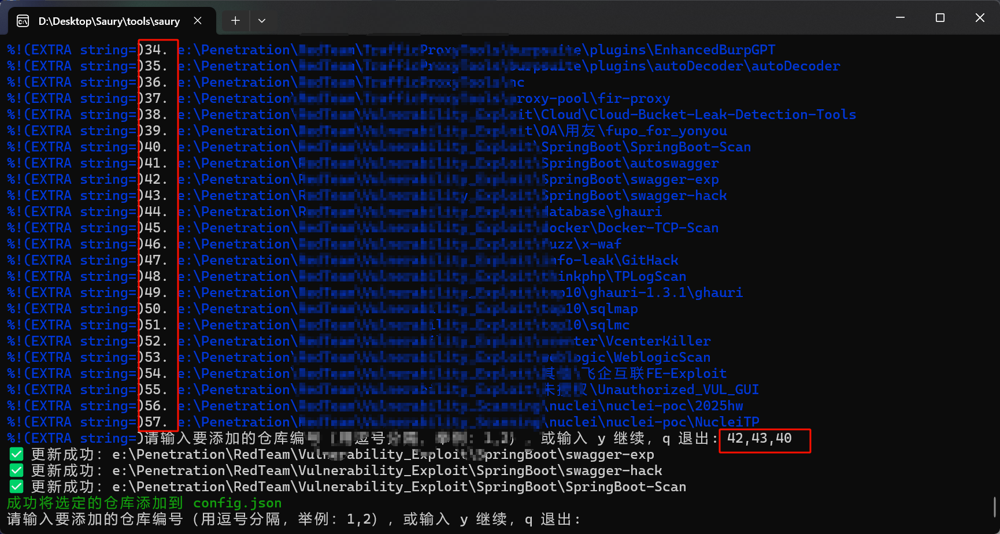
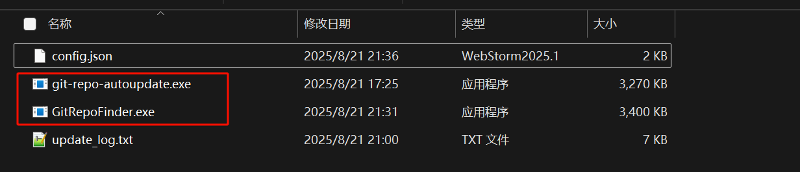

# Git 仓库查找工具

## 简介

此工具用于在指定目录中查找所有 Git 仓库，并将其路径存储在配置文件中。用户可以动态添加找到的仓库，并通过简单的命令行界面进行交互。

## 特性

- 递归查找指定路径下的所有 Git 仓库
- 动态显示遍历进度
- 将找到的仓库路径保存到 `config.json` 文件中
- 交互式输入，方便用户选择要添加的仓库

## 安装

1. 确保您的系统上已安装 Go 编程语言。
2. 克隆此仓库或下载源代码：
   ```bash
   git clone <repository-url>


## 使用


输入要遍历的路径


最后找到有仓库的会携带编号打印出来，可以输入编号，会添加到config.json里，使用需要配合[git-repo-autoupdate](https://github.com/z50n6/git-repo-autoupdate/git-repo-autoupdate)  使用。





该工具打包后，跟[git-repo-autoupdate](https://github.com/z50n6/git-repo-autoupdate/git-repo-autoupdate) 放到同一个路径下使用



帮助快速找到从存在 `.git`的目录。
