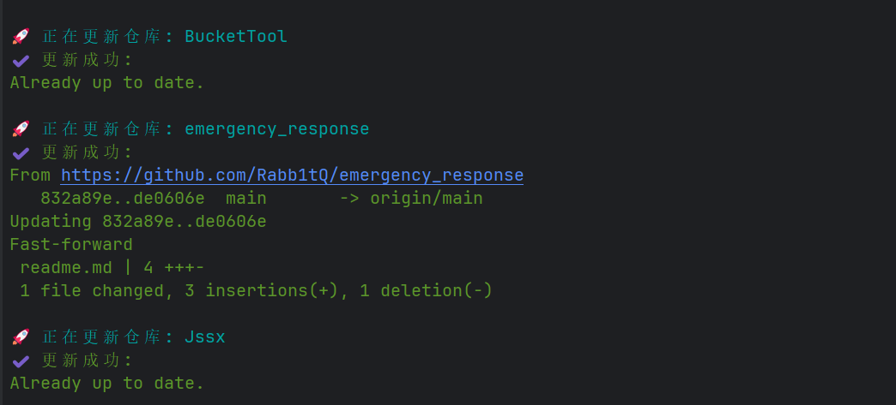

# Git 更新脚本

一个简单的 Go 脚本，用于批量更新多个 Git 仓库。脚本会读取配置文件，使用 `git pull` 命令更新指定的仓库，并支持通过代理访问。

## 特性

- 从 JSON 配置文件中读取多个 Git 仓库的路径。
- 支持设置 HTTP/HTTPS 代理。
- 彩色终端输出，清晰显示更新状态。
- 记录更新日志，包括时间戳和更新结果。

## 配置文件

```json
{
  "repositories": [
    "d:\\code\\repo1",
    "d:\\code\\repo2"
  ],
  "proxy": "127.0.0.1:7890"
}
```

- `repositories`: 一个字符串数组，包含要更新的 Git 仓库的完整路径。
- `proxy`: 可选的代理地址。


## 环境要求

- 安装 [Go](https://golang.org/dl/)（版本 1.15 或更高）。
- 已安装并配置 [Git](https://git-scm.com/downloads)。


## 输出实例

运行脚本后，您将在终端看到类似如下的彩色输出：



